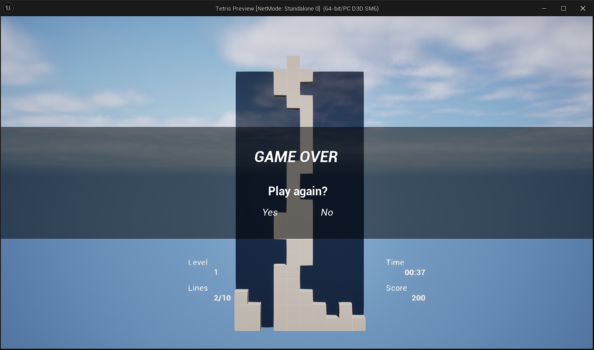

# Tetris
An implementation of Tetris in Unreal 5

# Introduction

This project serves as a demonstration of my knowledge of C++ and Blueprints in Unreal Engine 5. To run the game, open the project in Unreal Editor 5.3 or later and press Play in Editor.

# Controls

Movement: WASD or D-pad
Rotation: E/Q or R1 and L1

# Features

This is a standard version of Tetris, but there are some things 

- Animated UMG game start and end UI
- Board logic implemented to facilitate one-move-lookahead for upcoming AI system.
    - Architecture has been adapted from [this document](https://tildesites.bowdoin.edu/~echown/courses/210/javalab9/TetrisAssignment.pdf).

# TODO:

I will be adding the following features in the next few updates:

- Fast-drop functionality
- Piece preview
- Apply piece colors to instanced static mesh components
- Main menu and pause menu
- In game controls screen
- AI Pawn for demo mode

# Screenshot:

Below is a screenshot of the game.

